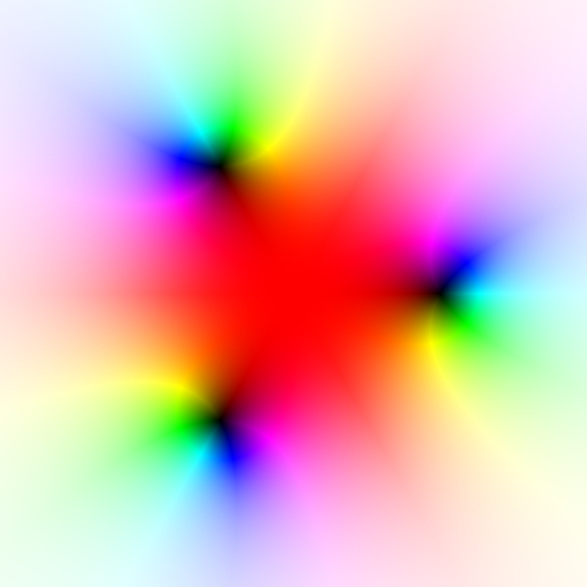

## Overview
This repository contains code written for my thesis project at the University of Virginia, for which I am developing a library for plotting fractals and functions of a complex variable using NVIDIA graphics cards. The code is divided across five files, each of which accomplish some "idea":

* `color.cu` defines a struct for holding RGB values and some utility functions related to this representation.
* `image.cu` defines a struct for images files, along with functions for reading from and writing to the `.ppm` format. This [format](https://en.wikipedia.org/wiki/Netpbm) stores the raw pixel values (meaning large file sizes), but is simple enough to make a reader/writer from scratch.
* `kernels.cu` defines the kernels for each type of plot. This is where most of the heavy math is done.
* `stills.cu` defines functions for rendering to `.ppm` image files.
* `window.cu` defines functions for rendering in a game window.

We will now discuss each type of plot supported by the library.

## Domain Coloring
Suppose we want to visualize a function $f: \mathbb{C} \to \mathbb{C}$. Because the input variable and output variable are each two-dimensional, to plot this function as we do functions $\mathbb{R} \to \mathbb{R}$ would require four spatial dimensions, a luxury we unfortunately lack.

A solution is that we can use color in our plots. The first technique we describe is known as *domain coloring*, wherein we draw some subset of $\mathbb{C}$ over which the function is to be plotted, and encode the output at each point in that point's color.

In particular, given a complex number $z \in \mathbb{C}$, the function
```math
\begin{align*} H &= \frac{\arg z}{2\pi} + \frac{1}{2} \\ S &= 1 \\ L &= \frac{2}{\pi}\arctan|z| \end{align*}
```
defines a color in the $HSL$ color model. This will be the color we assign to the pixel corresponding to the point $z$. However, we first need to convert it from the $HSL$ color model to the $RGB$ model. This is done using the function `hsl_to_rgb` defined in `color.cu`, inspired by the procedure detailed by
[Saravanan, Yamuna, and Nandhini](https://ieeexplore.ieee.org/abstract/document/7754179).

Heuristically, what this accomplishes is that the phase (or angle) of $f(z)$ is encoded by the hue of $z$, while the magnitude of $f(z)$ is encoded by the brightness of $z$. With domain coloring, we can produce visualizations like the following depiction of the polynomial $z^3 - 1$.



Pictorially, we can *see* its roots, the third roots of unity, because in our color map, a magnitude of zero corresponds to black.

### Phase Portraits
Phase portraiture is a variation on domain coloring, except that the magnitude of $f(z)$ is ignored; the phase of $f(z)$ is the sole determinant of the color we assign to $z$.

## Conformal Mapping
TODO [Mercat](https://en.wikibooks.org/wiki/Fractals/Conformal_map)

## Escape-Time Fractals
TODO

### Normalization
TODO

## To-Do List
High Priority:
* Fix zooming so it centers around mouse position
* Move annoying calculations inside the kernels
* Unify kernels (via optional parameters)
* Toggleable axes in the window
* Be safer about types (avoid F, swap between float/double)
* Improve this documentation

Low Priority:
* Added phase portraits as another plot type
* Command line progress bar?
* Write CPU version and compare performance
* Reading from .csv file on website
* Update renders on website and write descriptions

## References
Many examples and techniques were drawn from these excellent resources. I highly recommend them if you are looking to learn more.

* [Phase Plots of Complex Functions: A Journey in Illustration](https://www.ams.org/notices/201106/rtx110600768p.pdf)
* [Visual Exploration of Complex Functions](https://math.okstate.edu/people/scurry/5283/sp21/17_Wegert2016_Chapter_VisualExplorationOfComplexFunctions.pdf)
* [Conformal Image Warping](https://apps.dtic.mil/sti/tr/pdf/ADA210016.pdf)
* [Hans Lundmark's Complex Analysis Pages](https://users.mai.liu.se/hanlu09/complex/)
* [Domain Coloring of Complex Functions](http://www.javaview.de/domainColoring/)
* [Computing the Lerch transcendent](https://fredrikj.net/blog/2022/02/computing-the-lerch-transcendent/)
